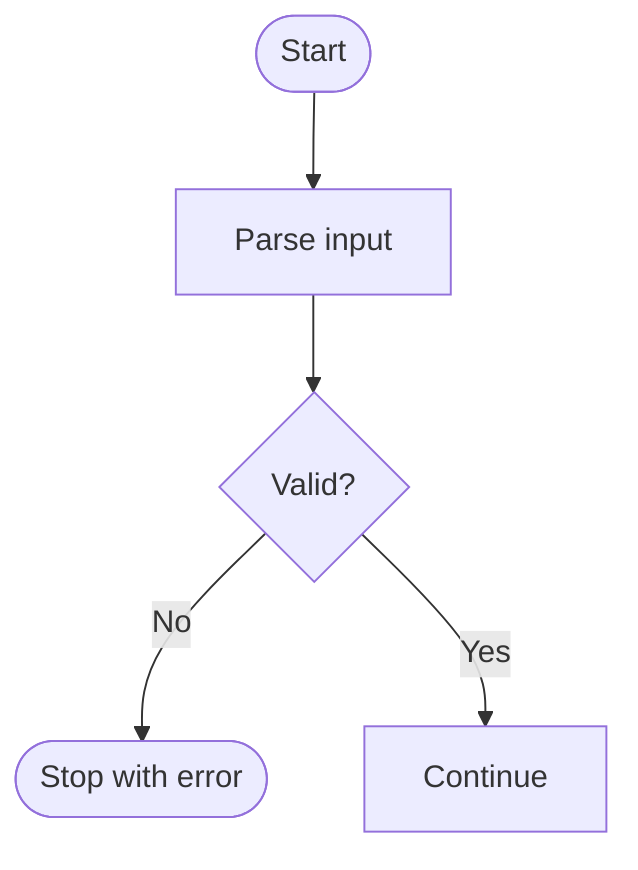

# Better Explain Diagram Patterns

## Selection Matrix

| Question shape | Best default | Why |
| --- | --- | --- |
| "What steps happen?" | Mermaid flowchart | Clear for start, transform, decision, and end |
| "Who talks to whom, and in what order?" | Mermaid sequence diagram | Preserves temporal order across actors |
| "What states can this thing be in?" | Mermaid state diagram | Makes transitions explicit |
| "How is this data organized?" | Mermaid class diagram or ER diagram | Good for fields, ownership, and relationships |
| "What does this tree or graph literally look like?" | Graphviz `dot` or D2 | Better layout control when shape correctness matters |

## Markdown-First Patterns

### Inline Mermaid

Use this first when the renderer supports Mermaid:

````markdown

````

### Static SVG Embed

Use this when Mermaid is not rendered by the target markdown viewer:

````markdown

````

## Render Commands

### Mermaid CLI via npx

```bash
npx -y -p @mermaid-js/mermaid-cli mmdc -i diagram.mmd -o diagram.svg
```

Render a markdown file with Mermaid blocks into a markdown file with SVG image references:

```bash
npx -y -p @mermaid-js/mermaid-cli mmdc -i explainer.template.md -o explainer.md
```

### D2

```bash
d2 architecture.d2 architecture.svg
```

### Graphviz

```bash
dot -Tsvg graph.dot -o graph.svg
```

## Diagram Review Checklist

1. Does every node map to a real concept from the source?
2. Does every edge mean one specific thing?
3. Are branch labels present where a user could misread the arrow?
4. Does the diagram answer the exact user question rather than the whole system?
5. Are simplifications or omitted error paths stated below the graph?

## Mermaid Cautions

- Mermaid is strict. Unknown words, misspellings, or special token choices can break a diagram.
- In flowcharts, lowercase `end` is a known parser footgun.
- For large systems, split the explanation into multiple focused diagrams instead of one dense graph.
